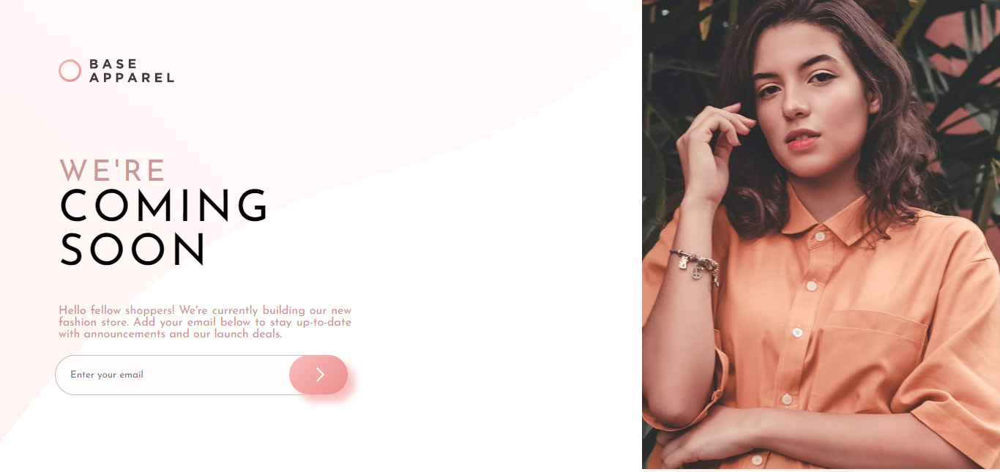

# UI-UX-with-simple-validation
## Table of contents
 
- [Overview](#overview)
- [Screenshot](#screenshot)
- [Links](#links)
- [Built with](#built-with)
- [Useful resources](#useful-resources)
- [Author](#author)
 
## Overview
 
This is a responsive web design of a clipboard page using HTML, CSS and Javascript
 
### Screenshot
 

 
### Links
- Live Site URL: (https://reham9012.github.io/UI-UX-with-simple-validation/)
 
### Built with
 
- HTML5 markup
- CSS 
- Javascript

### Useful resources
 
Just used font awesome for a few icons.
 
## Author
 
- Frontend Mentor - (https://www.frontendmentor.io/profile/reham9012)
- Github - (https://github.com/reham9012)